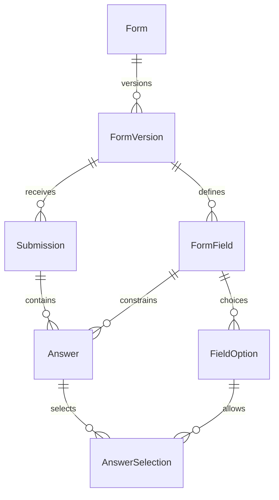

# Data model and reporting

## Storage choice

Forms are defined dynamically without code deployments or database migrations for each new form. This implementation uses a **typed entity/attribute/value model** with strict ownership and scalar constraints, then publishes conventional named-column SQL views for reports. This is a deliberate choice between two valid interpretations of structured forms:

| Approach                                               | Adding a form                        | Reporting                                    | Schema changes                           |
| ------------------------------------------------------ | ------------------------------------ | -------------------------------------------- | ---------------------------------------- |
| Implemented: typed relational answers plus named views | API / CMS operation                  | Stable typed columns per named form revision | New immutable revision and view          |
| Dedicated physical table per form                      | Migration and generated Prisma model | Direct table columns                         | Reviewed schema migration and deployment |

No answers or form definitions are saved into JSON columns, serialized objects, or comma-separated values. JSON remains the HTTP transport format. The database stores field names, validation rules, and option definitions in real columns and related rows.



## Tables and invariants

| Table             | Purpose and important constraints                                                                                                                                   |
| ----------------- | ------------------------------------------------------------------------------------------------------------------------------------------------------------------- |
| `Form`            | UUID identity and globally unique immutable snake_case key.                                                                                                         |
| `FormVersion`     | Title, description, access policy, immutable definition fingerprint, sequential version number, status, audit actors/times. At most one published version per form. |
| `FormField`       | Named key unique within a version; explicit type, position, required flag, text length and numeric bounds.                                                          |
| `FieldOption`     | Named option key and label, owned by a field/version.                                                                                                               |
| `Submission`      | Exact version, server timestamp, UUID idempotency key, canonical request hash, verified member ID, and optional source page path.                                   |
| `Answer`          | One scalar value in a type-specific column, or a multi-select answer parent; unique per submission/field.                                                           |
| `AnswerSelection` | One row per selected option, with composite ownership foreign keys and duplicate prevention.                                                                        |

Composite foreign keys ensure:

- An answer's submission and field belong to the same version.
- Its discriminator matches the field's declared type.
- A selected option belongs to the answer's field and version.
- Selection rows belong only to multi-select answers.

SQL CHECKs enforce scalar presence and prevent simultaneous values in incompatible columns. Deferred constraint triggers check required answers, configured lengths/numeric bounds, and nonempty multi-select answers after the entire submission transaction is written. Immediate checks would incorrectly reject the envelope before its answers exist.

The API additionally validates email syntax, exact decimal input precision, real calendar dates, safe field keys, definition consistency, option allowlists, and unknown fields. Database triggers reject changes to published/retired definitions and answer updates. No API allows submission editing. Deleting a whole submission through a controlled retention job cascades to answers/selections.

API form registration and revisions are serialized on the stable form row. Publication, retirement, and submission acceptance use the same lock. This favors simple consistency for occasional website forms; it serializes submissions to the same form. Revisit this locking strategy if measured submission volume requires greater throughput.

## Field semantics

- `INTEGER` is PostgreSQL `integer` (signed 32-bit), sent as a JSON number.
- `DECIMAL` is `numeric(20,6)`: up to 14 integer digits and 6 fractional digits. Send exact decimal **strings**, not JavaScript floating-point numbers. HTTP reports return exact strings. SQL views retain the numeric type.
- `DATE` is a calendar date from year 0001 through 9999; no timezone conversion. Send `YYYY-MM-DD`.
- `BOOLEAN` accepts both `true` and `false`. “Required” means an explicit answer, not mandatory consent. Use a required single-choice acceptance field with only the accepted option if affirmative acknowledgement is needed.
- Missing, null, blank, or empty-array optional answers are omitted. False and zero are retained. Missing required answers are rejected.
- Choices use stable keys for reports; labels are presentation copy. Multi-selects are rows in storage and `text[]` in SQL views.

## Versioned views

Publishing `event_interest` version 1 creates `forms_reporting.event_interest_v1` in the same transaction as the publication status change. If view creation fails, publication and retirement of the previous version roll back.

View metadata columns are reserved and cannot be used as field keys:

| Column          | SQL type          |
| --------------- | ----------------- |
| `submission_id` | uuid              |
| `submitted_at`  | timestamptz       |
| `member_id`     | varchar, nullable |
| `source_page`   | varchar, nullable |
| `form_version`  | integer           |

Every remaining column has the field's name and real SQL type. Missing optional values are null. Identifiers are limited and validated before DDL construction; UUID literals are validated separately. All ordinary queries use Prisma or parameterized SQL. The API accepts no arbitrary SQL.

```sql
-- One row per submitted form, including exact named columns.
SELECT submission_id, submitted_at, email, full_name,
       interests, receive_updates
FROM forms_reporting.event_interest_v1
WHERE submitted_at >= TIMESTAMPTZ '2026-09-01 00:00:00+00';

-- Aggregate relational choices using a conventional SQL array projection.
SELECT interest, count(*) AS submissions
FROM forms_reporting.event_interest_v1
CROSS JOIN LATERAL unnest(interests) AS interest
GROUP BY interest;

-- Explicitly combine compatible columns across revisions.
SELECT submission_id, submitted_at, email, 1 AS revision
FROM forms_reporting.event_interest_v1
UNION ALL
SELECT submission_id, submitted_at, email, 2 AS revision
FROM forms_reporting.event_interest_v2;
```

There is no automatically changing “latest” report view: silently changing its column types would break reports. Pin a revision, or create an explicitly reviewed cross-version report. Field semantics may change between versions, so a cross-version union is a reporting decision.

SQL views are computed rather than materialized. They are indexed through the submission/version and submission/field indexes on the base tables. For large BI workloads, use a reporting replica or a warehouse job based on these stable views.

## Lifecycle and retention

The service supports `DRAFT -> PUBLISHED -> RETIRED`. Published versions cannot return to draft; retired versions cannot be reopened. Create the next sequential revision to reopen or change a form. Draft content becomes immutable through the API when first saved; local Payload drafts can be edited freely until synchronized.

Versions and historical reporting views are retained. The service does not impose an arbitrary retention period or add deletion endpoints. An approved retention policy can delete whole submission envelopes in batches; cascading foreign keys remove child data. Definition records remain for interpretation of retained historical data. Reports and database grants expose personal submission information only to their authorized readers.
